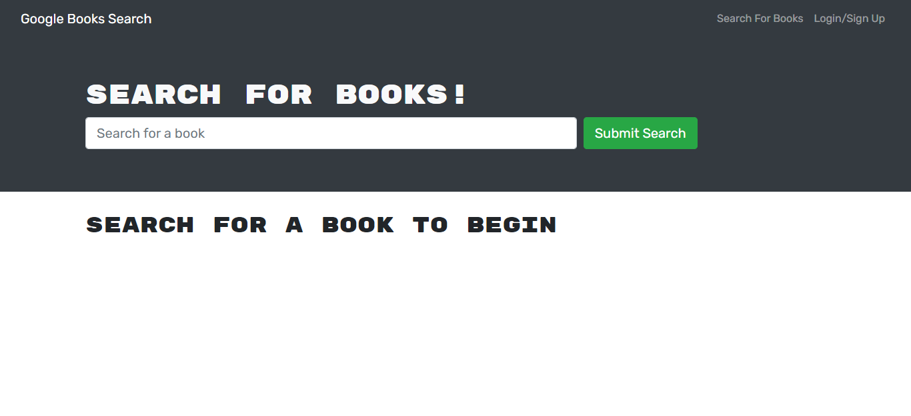

# Book Search Engine

## Project Link

[_View my project here_](https://arcane-sierra-35513.herokuapp.com/)

## Table of Contents

- [_Project Link_](#project-link)
- [_About my Project_](#about-my-project)
- [_Installation_](#installation)
- [_Screenshots_](#screenshots)

## About my Project

For this project, I've refactored an existing Google Books API search engine, that used a RESTful API, by implementing a GraphQL API instead. I have used Apollo Server to do so. </br>
The user can search books and if they sign up and login, they can also save the books of their choice. Once saved, books can very easily be deleted from the saved list.

## Installation

```
git clone https://github.com/misha244/mern-book-search-engine.git
cd mern-book-search-engine
npm run install
```

## Screenshots

### Homepage



### Search results and saved books


## Fin
